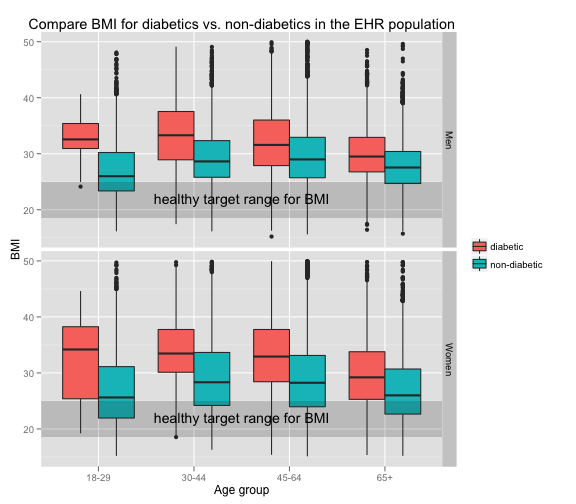

Test run
========================================================


```r
rm(list = ls())
library(ggplot2)
library(scales)
library(car)
```

```
## Loading required package: MASS
```

```
## Loading required package: nnet
```

```r

# pull data in
d2 = read.csv("~/Work/Kaggle/d2.csv")
# do some data clean up
d2$Height = as.numeric(d2$Height)
d2$dmIndicator = as.logical(d2$dmIndicator)

d2$age = d2$VisitYear - d2$YearOfBirth
d2$age[d2$age < 10] = NA
d2$age.bin = cut(as.numeric(d2$age), c(10, 30, 45, 65, 100), c("18-29", "30-44", 
    "45-64", "65+"))
d2$Gender2 = recode(d2$Gender, "'M'='Men'; 'F'='Women'; else=NA")
d2$dmIndicator2 = recode(d2$dmIndicator, "TRUE='diabetic'; FALSE='non-diabetic'; else=NA")
```

```
## Warning: NAs introduced by coercion
```

```r
d2.ss = subset(d2, Weight < 400 & Weight > 60 & Height > 48 & Height < 96)
```


And a plot

```r
p <- qplot(age.bin, BMI, data = subset(d2.ss, !is.na(age.bin)), fill = dmIndicator2, 
    geom = "boxplot", position = "dodge", ylim = c(15, 50), aes(linetype = "dotted"), 
    main = "Compare BMI for diabetics vs. non-diabetics in the EHR population") + 
    facet_grid(Gender2 ~ .)
p + annotate("rect", ymin = 18.5, ymax = 25, xmin = -Inf, xmax = Inf, alpha = 0.2) + 
    labs(x = "Age group", y = "BMI", fill = "") + annotate("text", x = 2.5, 
    y = 22, label = "healthy target range for BMI")
```

```
## Warning: NAs introduced by coercion
```

```
## Warning: NAs introduced by coercion
```

```
## Warning: Removed 70 rows containing non-finite values (stat_boxplot).
```

```
## Warning: Removed 381 rows containing non-finite values (stat_boxplot).
```

 


[Imgur](http://i.imgur.com/oAnli)

